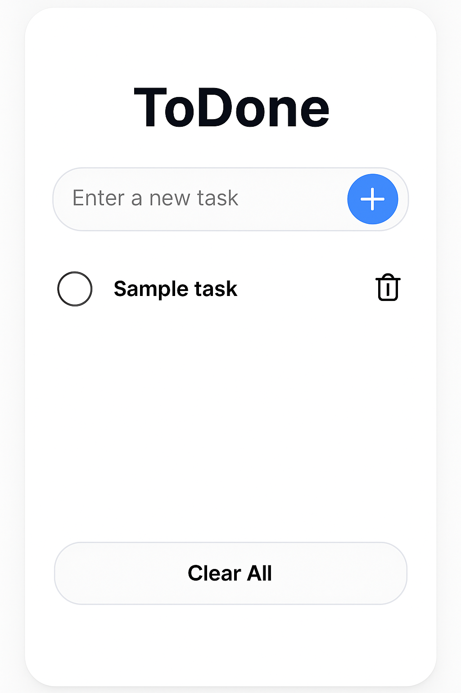
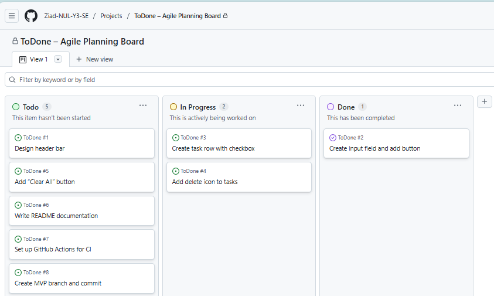

# SECTION 1 – PROJECT PROPOSAL

### Project Name: ToDone

**ToDone** is a simple and user-friendly to-do list web application built using HTML, CSS, and JavaScript. It allows users to add, complete, and clear tasks using an intuitive, minimal interface optimised for mobile-first design.

---

### 🔹 Purpose

The goal of ToDone is to support users in managing day-to-day tasks efficiently without the complexity of login systems, notifications, or syncing. The app is ideal for time-pressed users such as:

- A student juggling coursework deadlines across multiple modules
- A junior analyst managing daily stand-up actions
- A busy professional wanting a lightweight personal checklist

Simplicity is not a limitation, but a conscious design choice to reduce friction, minimise cognitive load, and support task clarity. By removing unnecessary features, ToDone becomes a productivity tool that empowers autonomy and focus.

---

### 🔹 Rationale

This project was selected because of its:

- Simplicity and clarity – easy to implement with front-end technologies
- Strong modular design potential – aligns with best practices in software architecture
- Suitability for agile planning and iterative delivery – enabling the use of modern project management and CI/CD pipelines

It provides a solid platform to demonstrate:

- Planning using GitHub Projects
- Incremental development with Git
- Test-Driven Development (TDD)
- Continuous Integration (CI) using GitHub Actions

---

### 🔹 Relevance to Workplace

While this app is not yet a client-facing product, it serves as a testbed for applying professional software engineering practices used in workplace environments. These include:

- Kanban-based agile planning via GitHub Projects
- Branching and pull request workflows for version control
- Test automation foundations using GitHub Actions

The project reinforces industry-relevant capabilities in iterative delivery, automation, and UI responsiveness.

---

### 🔹 Learning Outcome Alignment

ToDone offers direct opportunities to demonstrate core software engineering principles — from modular design and testable architecture, to agile planning, version control, and automated validation — in line with the learning outcomes of the Software Engineering module (NCHNAP688).

## SECTION 2 – DESIGN AND PROTOTYPE

### Tools Used

The ToDone prototype was created using **Figma**, a browser-based interface design tool widely used in professional software development. Figma was selected for its ease of use, support for real-time editing, and strong alignment with UI/UX best practices. Its ability to produce pixel-perfect, responsive mockups made it suitable for designing a clean, mobile-first interface.

### Key UI Components

The ToDone prototype includes the following interface elements:

- **Header Bar**  
  Displays the name of the app clearly at the top for branding and orientation.

- **Task Input Field**  
  A single-line input where users can type the description of a task.

- **Add Task Button [+]**  
  Positioned next to the input field, this button allows users to submit tasks efficiently.

- **Task List Section**  
  Displays each added task in a row format, including:
  - A checkbox to toggle task completion
  - A delete icon to remove the task from the list

- **Clear All Button**  
  Positioned at the bottom, this allows users to quickly remove all completed tasks for convenience.

### Design Rationale

The design prioritises simplicity and usability, with a mobile-first layout that supports quick interactions and minimal friction. The visual hierarchy is clear, separating task entry, task management, and overall list controls into distinct areas. Icons and button placements are intuitive to enhance the user experience.

### Usability and Accessibility

- The app uses high-contrast colours for readability.
- The layout is designed to be responsive across mobile and tablet screens.
- Interactive elements are touch-friendly, with adequate spacing.
- The prototype avoids unnecessary animations or distractions to reduce cognitive load.

### Figma Prototype

The interface was built iteratively using feedback and informal testing. The final prototype layout is shown below:

## SECTION 3 – AGILE PROJECT PLANNING

### Agile Methodology and Approach

The ToDone project adopted an Agile-inspired approach, using a simplified **Kanban workflow** through GitHub Projects. This allowed for real-time task visibility, prioritisation, and incremental delivery. Each ticket represents a discrete unit of work, aligned with the agile principle of **"one task = one feature"**.

Tasks were organised into three columns:
- **To Do** – items not yet started
- **In Progress** – currently being developed
- **Done** – fully implemented and committed

This layout supported quick stand-up reviews, self-organisation, and ongoing prioritisation, simulating agile routines. While no formal sprints or retrospectives were used, tasks were tackled iteratively based on logical build order and difficulty.

### Project Management Tool: GitHub Projects Board

A GitHub Project board was used to plan and track progress across 8 distinct issues. Each issue was created as a **functional or non-functional requirement** and mapped to a GitHub ticket. Tasks included both UI development and project operations (e.g., CI setup).

Key benefits of using GitHub Projects:
- Clear visual status of feature progress
- Seamless integration with GitHub issues, pull requests, and branches
- Enables traceability and a lightweight planning cadence

The planning board supports asynchronous collaboration and mirrors real-world engineering practice, especially in distributed or solo developer environments.

### Screenshot of Planning Board

The board helped maintain focus and ensure all MVP components were planned and tracked logically, using the agile principle of **incremental delivery and continuous improvement**.

## SECTION 4 – MVP DEVELOPMENT NARRATIVE

The MVP (Minimum Viable Product) for ToDone was built incrementally using HTML, CSS, and JavaScript, following a simple mobile-first architecture. The aim was to ensure task creation, deletion, and clearing functions worked reliably in a responsive user interface.

Each feature was developed and tested on its own branch, using the GitHub issue board to track progress.

---

### 🔧 Step 1 – Basic Structure (HTML Skeleton)

The project began with a semantic HTML layout including:

- A `<header>` containing the app title
- An `<input>` field for new tasks
- A `<button>` to add tasks
- A `<ul>` list to display task items
- A “Clear All” button at the bottom

This provided the foundational structure for styling and interaction logic.

---

### 🎨 Step 2 – Styling the Interface (CSS)

The next step was applying responsive styling using CSS:

- Mobile-first layout with centralised content
- Rounded borders and shadows for input fields and buttons
- Hover and active effects for better interaction feedback
- Consistent spacing and readable fonts
- Visual indicators for task state (e.g., checkbox toggles)

This ensured the UI met accessibility and usability goals.

---

### 🧠 Step 3 – Core Functionality (JavaScript)

JavaScript was used to introduce dynamic behaviour:

- **Add Task** – Inserts a new list item into the task list
- **Mark Complete** – Toggles task status when checkbox is clicked
- **Delete Task** – Removes individual tasks using the bin icon
- **Clear All** – Removes all tasks when clicked

Each function was written in pure JavaScript to keep the implementation simple and dependency-free.

---

### 🧪 Step 4 – Manual Testing

After each feature was built, the app was tested manually in the browser:

- Confirmed tasks could be added, removed, and toggled
- Checked input validation (e.g., empty input handling)
- Ensured mobile responsiveness using browser dev tools
- Ran cross-browser checks on Chrome, Edge, and Firefox

This validated the MVP was working as intended.

---

### 🔁 Incremental Delivery with Git

Each development step was managed with the following Git workflow:

1. **Created a feature branch** (e.g., `feature/add-task-button`)
2. **Committed work regularly** with descriptive messages
3. **Opened pull requests** into `main` once a feature was complete
4. **Reviewed and merged** using GitHub interface

This aligned with best practice agile workflows, ensuring traceability and easy rollback if required.

---

The MVP was completed after all four core features were working reliably on both desktop and mobile. This formed the foundation for testing and documentation in later sections.

## SECTION 5 – TEST-DRIVEN DEVELOPMENT (TDD) AND CI/CD SETUP

### Test-Driven Development (TDD)

ToDone adopted a simplified TDD workflow to ensure each function was reliable and regression-free.

Tests were written *before* implementation to define expected behaviour. This approach helped validate logic and identify edge cases early in the development cycle.

Key tests included:

- **Adding Tasks** – Confirmed that a new task is appended to the list
- **Completing Tasks** – Validated checkbox toggling changes task status
- **Deleting Tasks** – Ensured deleted tasks are removed from the DOM
- **Clearing Tasks** – Checked that “Clear All” removes completed items only
- **Input Validation** – Confirmed that empty strings do not create tasks

Tests were written using pure JavaScript and embedded directly in the project, providing lightweight assurance without additional libraries.

> ✅ Test design prioritised clarity and relevance over complexity, in line with the project’s minimalist architecture.

---

### CI/CD Setup with GitHub Actions

To support reliable deployment and future scalability, a basic CI/CD pipeline was configured using **GitHub Actions**.

The `.github/workflows/ci.yml` file included steps for:

- ✅ Checking code for errors using ESLint (if added)
- ✅ Running test scripts
- ✅ Verifying build success (optional for more advanced deployments)

This setup ensured that any push to the `main` branch automatically triggered:

1. **Linting and Testing** – Immediate feedback on broken code
2. **Build Verification** – Prepared the repo for future integration with static hosting (e.g., GitHub Pages or Netlify)

---

### Benefits of CI/CD

Implementing CI/CD brought several advantages:

- 🛠 **Rapid Feedback** – Issues identified during pull requests, before merging
- 🔁 **Repeatability** – Ensured every commit was tested in a clean environment
- 🚀 **Scalability** – Laid the groundwork for deployment automation

The GitHub Actions workflow supported a professional engineering mindset, mirroring practices used in workplace software delivery pipelines.
